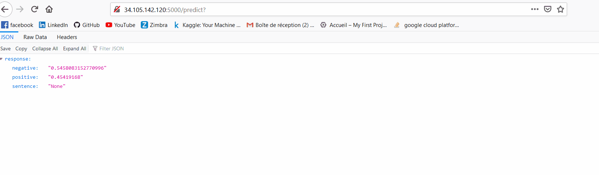

# Tweet Sentiment Extraction with Bert - Serving the app with Flask

Repo with code for training your own Bert model fine tuned on imdb dataset to serve it on a webapp using Flask.

## Demo

### Getting Started

Clone repository, install requirements, download datasets and pretrained bert model.

### Prerequisites

Must have a GPU for training and inference. You can train on CPU but this will very likely burn up your machine :).
Inference can be done through CPU, yet will not be very efficient.

Download following datasets and put them in input file (see config.py for paths I used):
* https://www.kaggle.com/lakshmi25npathi/imdb-dataset-of-50k-movie-reviews
* https://www.kaggle.com/abhishek/bert-base-uncased

## Requirements

* boto3==1.13.9
* botocore==1.16.9
* certifi==2020.4.5.1
* chardet==3.0.4
* click==7.1.2
* docutils==0.15.2
* filelock==3.0.12
* flask==1.1.2
* future==0.18.2
* idna==2.9
* itsdangerous==1.1.0
* jinja2==2.11.2
* jmespath==0.10.0
* joblib==0.14.1
* markupsafe==1.1.1
* numpy==1.18.4
* pandas==0.25.3
* python-dateutil==2.8.1
* pytz==2020.1
* regex==2020.5.13
* requests==2.23.0
* s3transfer==0.3.3
* sacremoses==0.0.43
* scikit-learn==0.22.2.post1
* scipy==1.4.1
* sentencepiece==0.1.90
* six==1.14.0
* sklearn==0.0
* tokenizers==0.5.2
* torch==1.5.0
* tqdm==4.46.0
* transformers==2.5.1
* urllib3==1.25.9 ; python_version != '3.4'
* werkzeug==1.0.1

## Acknowledgments

Thanks to Abhishek Thakur (x3 GM on Kaggle) for providing awesome tutorials. 
